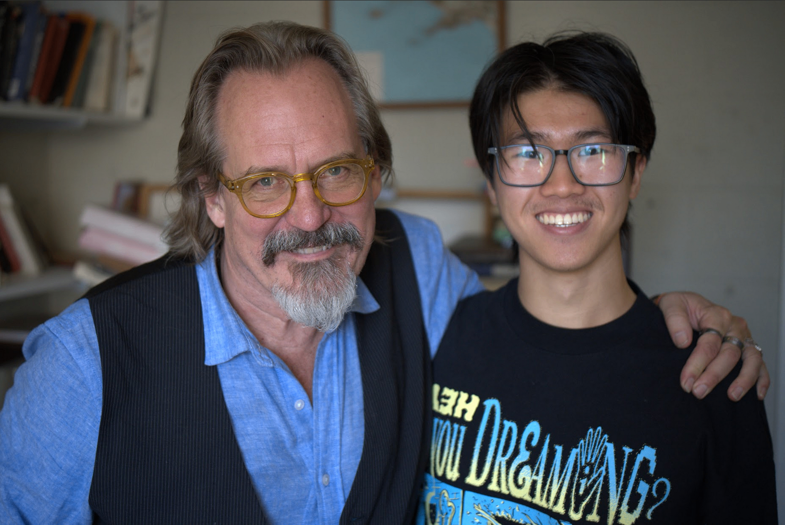

# Hi! I'm Kevi.

Behold, the man. 20M, math nerd from ny. ENFP

  

### Goals
- Meet new people & infect them with my enthusiasm
- Visit West Germany after uni

### Experience
- Teaching Assistant for Analysis of Algorithms (CSE/MAT 373) under Steven Skiena
- Teaching Assistant for Intro to Computer Science (CSE 101) under Kevin McDonnell
- Technology & Production Intern at Ideal Glass Studios
- Online Community Owner & Manager, Stony Brook Math Server
- Society of Physics Students Executive Board Member
- Experience coding in Java. Enjoying Python, Haskell, Rust 

### Education
- Coursework: Analysis of Algorithms, Data Structures, Stats, Mathematical Cryptography, Abstract Algebra, Linear Algebra II, Partial Differential Equations, Complex Analysis, Logic
- BS in Mathematics, 3.7 GPA

## I'm enjoying:

- Building computers
- Reading mathematical works
- Cooking food
- Prime crunching
- The Free Software philosophy
- Brazilian funk
- Cheese

### Mathematical Interests
- Hybrid sorting and searching algorithms
- Approximation algorithms & Complexity classes
- Category Theory
- Hyperelliptic & Elliptic Curves

### Languages
- English (Native)
- German (Elementary)

### Project Websites
- Blogs [here](/blogs/).

### Contact
- Email: kevin.chen.23 -- [at] -- stonybrook.edu

> "One day I will find the right words, and they will be simple."
> -- Jack Kerouac
